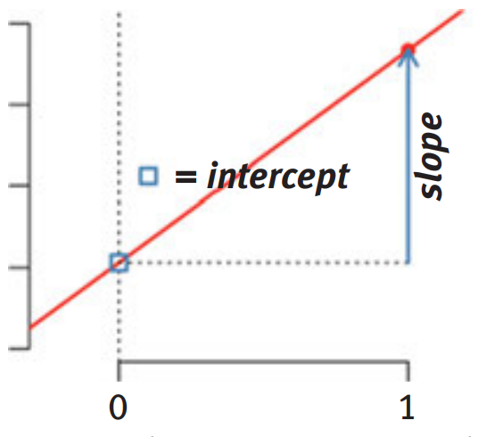

<style type="text/css">
body, td {
   font-size: 15px;
}
code.r{
  font-size: 15px;
}
pre {
  font-size: 20px
}
</style>

## Press record

---

## Background

.pull-left[
BA in <b> Psychology </b><br/>
MSC in <b> Applied Statistics</b><br/>
(Novi Sad, Serbia)
<br/>
<br/>

Phd in <b> Psychology </b> <br/>
(Klagenfurt, Austria)
<br/>
<br/>

Postdoc in <b>Data Science/Bioinformatics</b><br/>
(Oxford, UK)
<br/>
<br/>

Departments: Psychology, Applied Statistics, Psychiatry
]
.pull-right[

]

---
## Logistics

- 7 lectures (5 different statistical procedures + additional content)
<br/>
<br/>
  a) Generalized linear models <br/>
  b) Structural equation modelling: path models and confirmatory factor analysis <br/>
  c) Mixed-effects models: cross-sectional and longitudinal data <br/> <br/>
- Theory and practice
<br/>
<br/>
- Data, statistical analysis and commented code
<br/>
<br/>
- R as a statistical environment
<br/>
<br/>
- Practical exam (more information in a couple of weeks)
???
General overview of the course<br/>
<br/>
Focus on theory and applications, but also on how to use these models in R environment<br/>
<br/>
Each lecture is planned to be supported by html presentation with main slide content and lecturer's notes + commented code that produced outputs in the presentation. Often, I will include additional content that you can explore, but it is not going to be used for any subsequent knowledge assessments. 
---

## Linear regression

Method that summarises how the average values of numerical outcome variable vary over values defined by linear function of predictors ([visualisation](https://seeing-theory.brown.edu/regression-analysis/index.html#section1)) <br/> <br/>

--

$$ y = \alpha + \beta * x + \epsilon $$ 
--
```{r, fig.width=8, fig.height=5,fig.align='center', echo=FALSE}
par(bty='n',mar = c(5, 4, .1, .1), cex=1.1, pch=16)
data("cars")
plot(cars$speed, cars$dist, xlab='Predictor', ylab='Outcome')
abline(lm(dist~speed, data=cars), lwd=2)
```
???
Mathematical equation that estimates (simplifies) a dependent variable Y from a set of predictor variables or regressors X.<br/>

Each regressor gets a weight/coefficient that is used to estimate Y. This coefficient is estimated according to some criteria, eg. minimises sum of squared errors or maximises the logarithm of the likelihood function. Additional reading: <br/> [Estimation of the parameters](https://data.princeton.edu/wws509/notes/c2s2) 
<br/><br/>

$\epsilon$ - measure of accuracy of the model<br/>
$SS_{residual}=\sum_{i=1}^{n}(Y_{i}-\hat{Y}_{i})^2=\sum_{i=1}^{n}e_{i}^2$
---

## Example

Predict the height (cm) of babies from their age (months), weight (grams) and gender:

```{r,echo=F}
set.seed(456)
Babies=data.frame(Age=round(runif(100,1,30)), Weight=rnorm(100,4000,500))
Babies$Height=rnorm(100,40+0.2*Babies$Age+0.004*Babies$Weight, 5)
Babies$Gender=factor(rbinom(100,1,0.5))
levels(Babies$Gender)=c('Girls','Boys')
```

```{r,echo=T, fig.width=14, fig.height=5, fig.align='center'}
par(mfrow=c(1,3), bty='n',mar = c(5, 4, .1, .1), cex=1.1, pch=16)
plot(Babies$Age, Babies$Height, xlab='Age (months)', ylab='Height (cm)')
plot(Babies$Weight, Babies$Height, xlab='Weight (grams)', ylab='Height (cm)')
boxplot(Babies$Height~Babies$Gender,xlab='Gender', ylab='Height (cm)')
```

---

## Interpretation: one predictor

$$ y = \alpha + \beta * Age + \epsilon $$ 

```{r}
lm1<-lm(Height~Age, data=Babies)
lm1$coefficients
```

Counterfactual interpretation (causal): Increase of 1 unit in predictor value - Age (being one month older) changes the outcome by the $\beta$ (model estimated value) <br/> <br/>

Predictive interpretation (descriptive): If we compare babies that differ in their age by 1 month, we expect to see that older babies are taller by $\beta$ on average <br/> <br/>

???
Model summarises the difference in average Height between the children that vary in their Age. <br/> <br/>
Intercept is the average (predicted) score for children who are not born (0 - months)<br/> <br/>

---

## Interpretation: multiple predictors

$$y = \alpha + \beta_1 * Age + \beta_2 * Gender + \epsilon$$ 

Interpretation becomes contingent on other variables in the model <br/> <br/>

```{r}
lm2<-lm(Height~Age+Gender, data=Babies)
lm2$coefficients
```

Age: Comparing babies that have identical gender, but differ in their age by one month, the model predicts difference by a value of $\beta_1$ in their height on average<br/> <br/>

Gender: Comparing babies that have same age, but have different gender, the model predicts difference by a value of $\beta_2$ in their height on average <br/> <br/>

---

## Categorical predictors

$$y = \alpha + \beta_1 * Age + \beta_2 * Gender_{Boys} + \epsilon$$ 

What is the model doing:
.center[

]


Each level is assigned a value: Girls - 0, Boys - 1 <br/> <br/>
The slope coefficient $\beta_2$ models the difference between the two levels

---

## Interpretation: interactions

$$y = \alpha + \beta_1 * Age + \beta_2 * Gender_{Boys} + \beta_3 * Age*Gender_{Boys} + \epsilon$$ 

We allow the slope of age to linearly change across the subgroups of Gender variable<br/> <br/>

```{r}
lm3<-lm(Height~Age*Gender, data=Babies)
lm3$coefficients
```

Age: In the case of girls, comparing difference in babies older by month, the model predicts average difference by $\beta_1$ coefficient

Gender: Difference between girls who are 0 months old and boys who are 0 months old is $\beta_2$ coefficient

Age*Gender: Difference in the Age slope for Girls and Boys

---

## Interpretation: interactions

What about by-linear continous interactions?

$$y = \alpha + \beta_1 * Age + \beta_2 * Weight + \beta_3 * Age*Weight + \epsilon$$ 

```{r}
lm4<-lm(Height~Age*Weight, data=Babies)
lm4$coefficients
```

Age: Keeping weight at value of 0 and comparing babies that differ by 1 month in their age, the model predicts average difference of $\beta_1$ 

Weight: Keeping age at value of 0 and comparing babies that differ by 1 gram in their weight, the model predicts average difference of $\beta_2$

Age*Weight: The average difference between babies that differ by 1 month in their age, changes by $\beta_3$ with every 1 gram change in babies weight

---

## What other information do we get from linear model?

```{r}
lm1<-lm(Height~Age, data=Babies)
summary(lm1)
```

---

## Determination coefficient

$R^2 = 1 - \frac{SS_{residual}}{SS_{total}}$

```{r, echo=FALSE}
require(ggplot2)
Babies$lm1=predict(lm1, newdata = Babies)
Babies$diff=Babies$lm1-Babies$Height
```

```{r,fig.width=10, fig.height=5, fig.align='center', warning=FALSE}
ggplot()+geom_linerange(data=Babies,aes(x=Age, ymin=Height,ymax=lm1,colour=diff), size=1.2)+geom_line(data=Babies,aes(x=Age, y=lm1), size=1.2)+geom_point(data=Babies, aes(Age, y=Height), size=2)+ylab('Height')+xlab('Age')+ggtitle('SS_residual')
```

---

## Determination coefficient

$R^2 = 1 - \frac{SS_{residual}}{SS_{total}}$

```{r}
lm0<-lm(Height~1, data=Babies)
summary(lm0)
```

```{r, echo=FALSE}
Babies$lm0=predict(lm0, newdata = Babies)
Babies$diff2=Babies$lm0-Babies$Height
```

---

## Determination coefficient

$R^2 = 1 - \frac{SS_{residual}}{SS_{total}}$

```{r,fig.width=10, fig.height=5, fig.align='center', warning=FALSE}

ggplot()+geom_linerange(data=Babies,aes(x=Age, ymin=Height,ymax=lm0,colour=diff2), size=1.2)+geom_line(data=Babies,aes(x=Age, y=lm0), size=1.2)+geom_point(data=Babies, aes(Age, y=Height), size=2)+ylab('Height')+xlab('Age')+ggtitle('SS_total')
```

---

## Improvement in our prediction?

```{r, echo=FALSE}
Babies$diff3=Babies$lm1-Babies$lm0
```

$F = \frac{SS_m/df_m}{SS_r/df_r}$


```{r,fig.width=10, fig.height=5, fig.align='center', warning=FALSE}
ggplot()+geom_linerange(data=Babies,aes(x=Age, ymin=lm1,ymax=lm0,colour=diff3), size=1.2)+geom_line(data=Babies,aes(x=Age, y=lm0), size=1.2)+geom_line(data=Babies, aes(Age, y=lm1), size=1.3, linetype='dotdash')+geom_point(data=Babies, aes(x=Age, y=Height), size=0.9)+ylab('Height')+xlab('Age')+ggtitle('Improvement')
```

---

## Why is this important? 

The general linear model is a basis for all other models covered by this course <br/> <br/>

In particular, more complex statistical models are often just generalisations of the general linear model <br/> <br/>

The same would apply to "simpler" procedures, such as correlations, t-test, ANOVA, ANCOVA etc. <br/> <br/>

```{r}
cor(Babies$Height,Babies$Weight)
```

```{r}
Babies$HeightStand=scale(Babies$Height, scale=TRUE, center=TRUE)
Babies$WeightStand=scale(Babies$Weight, scale=TRUE, center=TRUE)
lmCorr<-lm(HeightStand~-1+WeightStand, data=Babies)
lmCorr$coefficients
```

---

## Asumptions

a) Errors: $\mathcal{N}^{iid}(0,\sigma^2)$ <br/> <br/>
b) Additivity and linearity <br/> <br/>
c) Validity <br/> <br/>
d) Weak exogeneity and lack of perfect multicolinearity <br/> <br/>

---
class: inverse, middle, center
# Practical aspect

---

#Practical work
Example dataset: Income inequality and rates of hate crimes -
[Article](https://fivethirtyeight.com/features/higher-rates-of-hate-crimes-are-tied-to-income-inequality/) and 
[Data](https://github.com/fivethirtyeight/data/tree/master/hate-crimes)

Reading local files to R:
```{r}
inequality<-read.table('inequality.txt',sep=',', header=T)
knitr::kable(head(inequality[,c(1,2,8,12)]), format = 'html')
```

---

##Dataset: outcome measures

Probability density plots: probability of the random variable falling within a range of values <br/>

```{r,fig.width=10, fig.height=5, fig.align='center'}
par(mfrow=c(1,2))
plot(density(inequality$hate_crimes_per_100k_splc, na.rm = T), main='Crimes per 100k')
plot(density(inequality$avg_hatecrimes_per_100k_fbi, na.rm = T), main='Average Crimes')
```

---

##Dataset: some of the predictors

```{r,fig.width=10, fig.height=5, fig.align='center'}
par(mfrow=c(1,2))
plot(density(inequality$median_household_income, na.rm = T), main='Income')
plot(density(inequality$gini_index, na.rm = T), main='Gini')
```

---

##Outcome: normality

Quantile-Quantile normality plot: Values plotted against the quantile of normal distribution

```{r,fig.width=10, fig.height=5, fig.align='center'}
qqnorm(inequality$avg_hatecrimes_per_100k_fbi)
```

---

##Bivariate plots

Scatter plots:

```{r,fig.width=10, fig.height=5, fig.align='center'}
plot(inequality$median_household_income, inequality$avg_hatecrimes_per_100k_fbi, xlab='Median household income',ylab='Avg hatecrimes')
```


---

##Bivariate plots

Scatter plots:

```{r,fig.width=10, fig.height=5, fig.align='center'}
plot(inequality$gini_index, inequality$avg_hatecrimes_per_100k_fbi,xlab='Gini index',ylab='Avg hatecrimes')
```

---

##Correlations in the data


```{r}
cor(inequality[,c(2,8,12)], use="complete.obs")
```

---

## Linear regression in R

```{r}
mod1<-lm(avg_hatecrimes_per_100k_fbi~median_household_income, data=inequality)
summary(mod1)
plot(inequality$median_household_income, inequality$avg_hatecrimes_per_100k_fbi, xlab='Median household income',ylab='Avg hatecrimes')
abline(mod1)
```

---

## Further improvements

Model comparison works beyond null - intercept only model and models with one or more predictors <br/> <br/>

We could use stepwise approach and build our models by sequentially adding the predictors

```{r}
mod2<-lm(avg_hatecrimes_per_100k_fbi~median_household_income+gini_index, data=inequality)
anova(mod2)
```

---

## Further improvements

We could also relative improvement off adding gini index to the model with median household income

```{r}
anova(mod1,mod2)
```

---

## Further improvements

```{r}
summary(mod2)
```

---

## Further improvements

We could also relative improvement off adding gini index to the model with median household income

```{r}
mod3<-lm(avg_hatecrimes_per_100k_fbi~median_household_income*gini_index, data=inequality)
anova(mod1,mod2, mod3)
```

---

## Further improvements

```{r}
summary(mod3)
```

---

## Further improvements

```{r,fig.width=10, fig.height=5, fig.align='center', warning=FALSE, message=FALSE}
require(interactions)
interact_plot(mod3, pred=median_household_income, modx=gini_index, plot.points = T)
```

---

## Further improvements

```{r, echo=FALSE}
simulatedD<-data.frame(median_household_income=rep(seq(35500, 76165, by=100), 13), gini_index=rep(seq(0.41,0.53, by=.01), each=407))
simulatedD$pred<-predict(mod3, newdata=simulatedD)
```

```{r, fig.width=10, fig.height=5,fig.align='center'}
p<-ggplot(simulatedD, aes(median_household_income, pred, color=gini_index,frame=gini_index))+geom_point()
plotly::ggplotly(p)
```

---

## Model diagnostics

Standardised residuals

$\epsilon_{Si}=\frac{\epsilon_i}{\sigma\sqrt{1-h_i}}$

Studentized residuals

$\epsilon_{Ti}=\frac{\epsilon_i}{\sigma_{(-i)}\sqrt{1-h_i}}$

---

## Model diagnostics

How should residuals behave? <br/> <br/>

Normality? 

```{r,fig.width=10, fig.height=4,fig.align='center'}
car::qqPlot(mod3)
```

[Cross-validated on residuals](https://stats.stackexchange.com/a/101290) and 
[Cross-validated shiny](https://xiongge.shinyapps.io/QQplots/)

---

## Model diagnostics

How should residuals behave? <br/> <br/>

Homoscedasticity? 

```{r,fig.width=10, fig.height=4,fig.align='center'}
car:: residualPlot(mod3, type='rstudent')
```

---

## Model diagnostics

How should residuals behave? <br/> <br/>

Outliers and leverage points? 

```{r,fig.width=10, fig.height=6,fig.align='center'}
car:: influenceIndexPlot(mod3, vars=c("Cook","studentized"))
```

---

## Model diagnostics

Outliers and leverage points? 

```{r, fig.width=10, fig.height=6,fig.align='center'}
car:: influenceIndexPlot(mod3, vars=c("Bonf","hat"))
```

[Further reading](https://www.sagepub.com/sites/default/files/upm-binaries/38503_Chapter6.pdf)<br/> <br/>

---

## Model evaluation

Rerun the model 

```{r}
mod3.cor<-lm(avg_hatecrimes_per_100k_fbi~median_household_income*gini_index, data=inequality, subset=-9)
summary(mod3.cor)
```

---

## Model evaluation

Interaction plot

```{r, fig.width=10, fig.height=6,fig.align='center'}
interact_plot(mod3.cor, pred=median_household_income, modx=gini_index, plot.points = T)
```

---

## Model evaluation

Interaction plot

```{r}
mod2.cor<-lm(avg_hatecrimes_per_100k_fbi~median_household_income+gini_index, data=inequality, subset=-9)
summary(mod2.cor)
```

---

## Higlighted aspects

What is linear model <br/> <br/>
Interpreting results ($R^2$,F statistic, predictor significance) <br/> <br/>
Interpreting estimated coefficients <br/> <br/>
Using linear models in R: overall and stepwise approach <br/> <br/>

Higher proficiency: <br/> <br/>
Model diagnostics based on pre and post-modelling procedures  covered  by the lecture and beyond